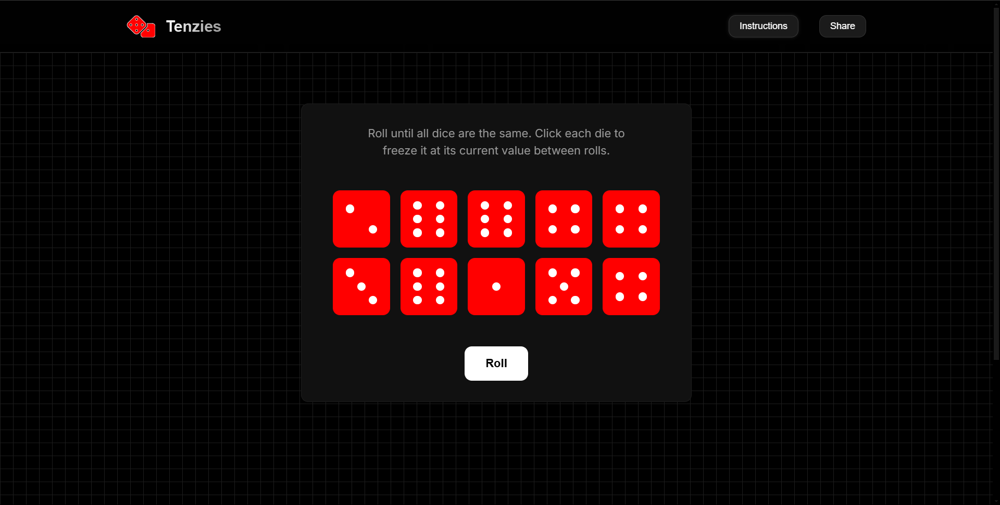
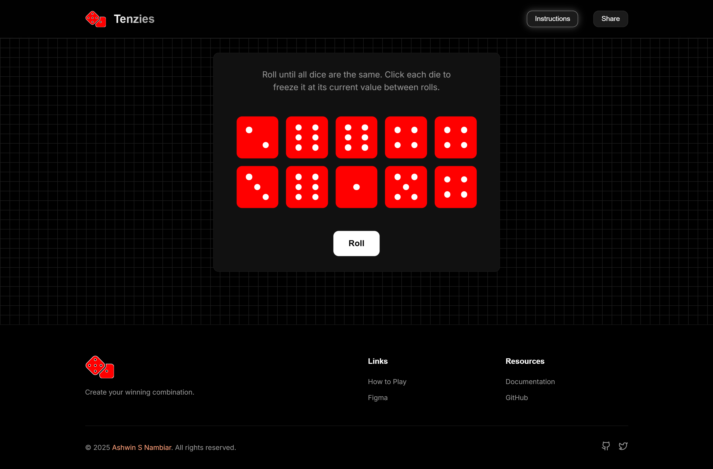
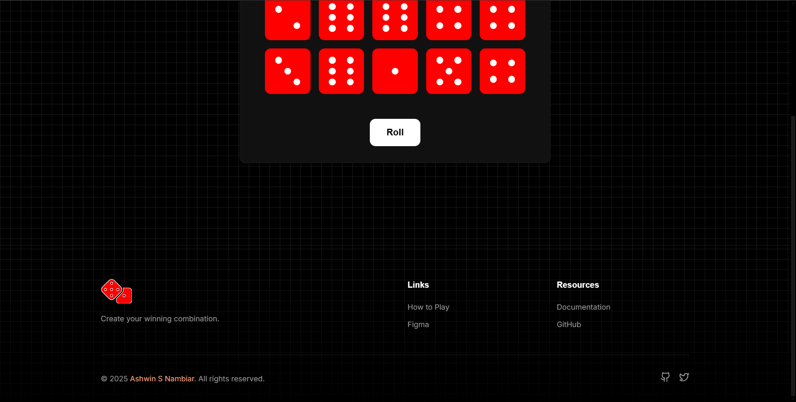
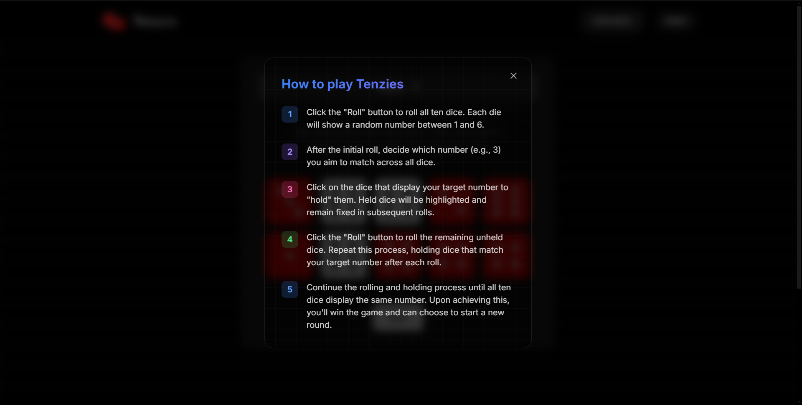
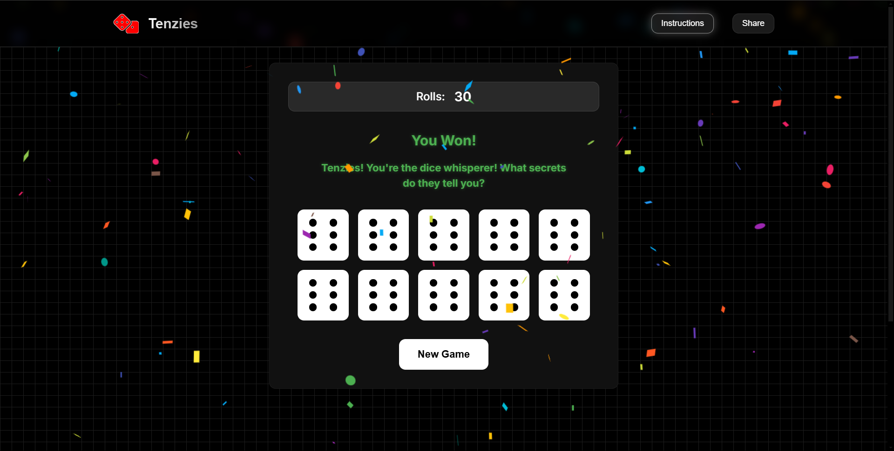
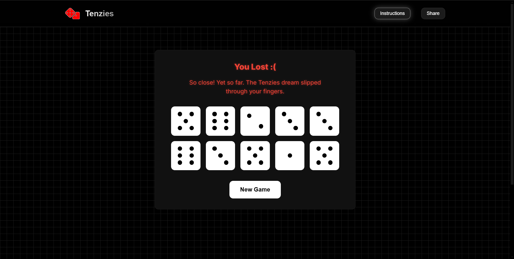

# Tenzies 

<div align="center">


An addictive dice game where strategy meets luck! Roll, hold, and match your way to victory with smooth animations and engaging gameplay.

[Features](#-features) • [Tech Stack](#-tech-stack) • [Game Rules](#-game-rules) • [Installation](#-installation) • [Contributing](#-contributing) • [Screenshots](#-screenshots) • [Live](#-live) • [Author](#-author)

</div>

## Features

- **Interactive Dice Rolling** - Click to roll and hold dice between turns
- **Performance Tracking** - Tracks the total rolls
- **Strategic Gameplay** - Choose which dice to keep for optimal results
- **Victory Celebrations** - Enjoy confetti animations upon winning
- **Responsive Design** - Play seamlessly on any device
- **Smooth Animations** - Engaging dice transitions and effects

## Tech Stack

### Core Technologies
- **[React](https://reactjs.org/)** - UI components and game logic
- **[Vite](https://vitejs.dev/)** - Next-generation frontend tooling
- **[Framer Motion](https://motion.dev/docs/quick-start)** - For smooth transitions and animations
- **CSS3** - Custom styling and animations
- **JavaScript** - Core game mechanics

### Libraries
- **[React Confetti](https://www.npmjs.com/package/react-confetti)** - Victory celebration effects

## Game Rules

1. **Start the Game**
   - Begin by rolling all ten dice
   - Each die shows a random number from 1 to 6

2. **Strategic Holds**
   - Click any die to "hold" its current value
   - Held dice won't change in subsequent rolls

3. **Continue Rolling**
   - Roll again to change unheld dice
   - Build sets of matching numbers

4. **Win Condition**
   - Match all ten dice to the same number
   - Celebrate with a confetti explosion!

## Installation

1. **Clone the repository**

   ```bash
   git clone https://github.com/Ashwin-S-Nambiar/Tenzies.git
   cd Tenzies
   ```

2. **Install dependencies**

   ```bash
   npm install
   ```

3. **Start the development server**

   ```bash
   npm run dev
   ```
   **The game will be available at `http://localhost:5173`.**

## Contributing

Want to make Tenzies even better? Here's how:

1. **Fork the repository**
2. **Create a feature branch:**

   ```bash
   git checkout -b feature/your-feature-name
   ```
3. **Make your changes and commit them:**

   ```bash
   git commit -m 'Add some feature'
   ```
4. **Push to the branch:**

   ```bash
   git push origin feature/your-feature-name
   ```
5. **Open a Pull Request**

## 📸 Screenshots

<div align="center">

### **Landing Page**


### **Full Interface**


### **Footer Section**


### **Instructions**


### **Victory Screen**



### **Game Lost**



</div>

## Live

<div align="center">

[](https://tenzies-nu-sooty.vercel.app/)

</div>

## Author

### Ashwin S Nambiar
- Portfolio: [ashwin.co.in](https://ashwin.co.in)
- GitHub: [@Ashwin-S-Nambiar](https://github.com/Ashwin-S-Nambiar)

---

<div align="center">
Made with ❤️ by Ashwin S Nambiar
</div>
