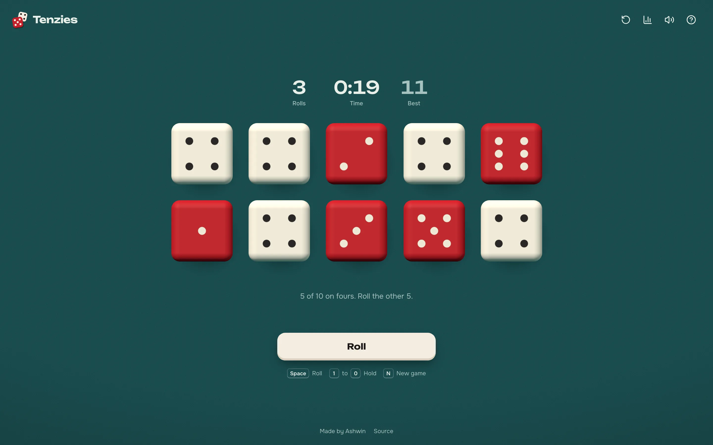
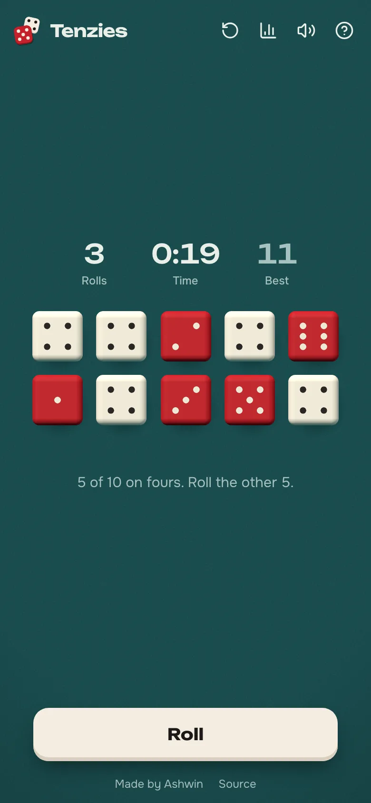
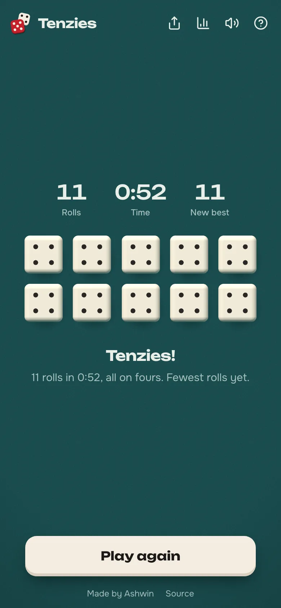
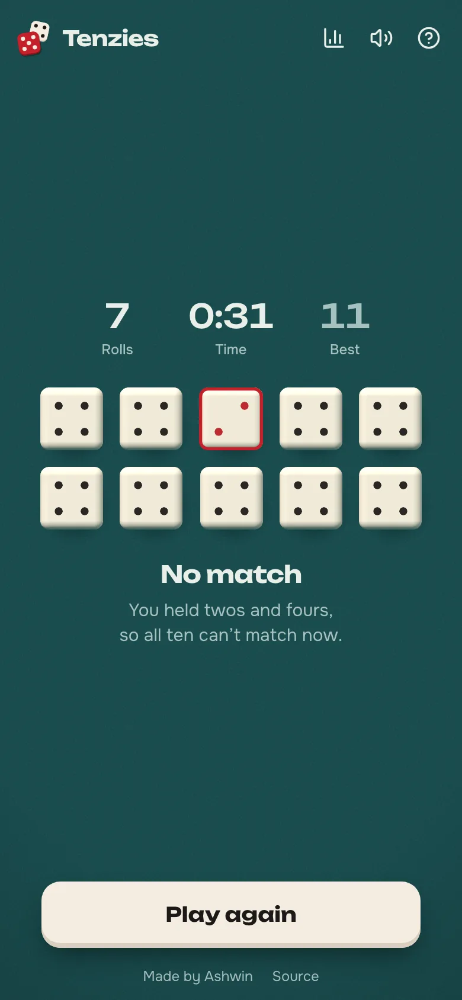
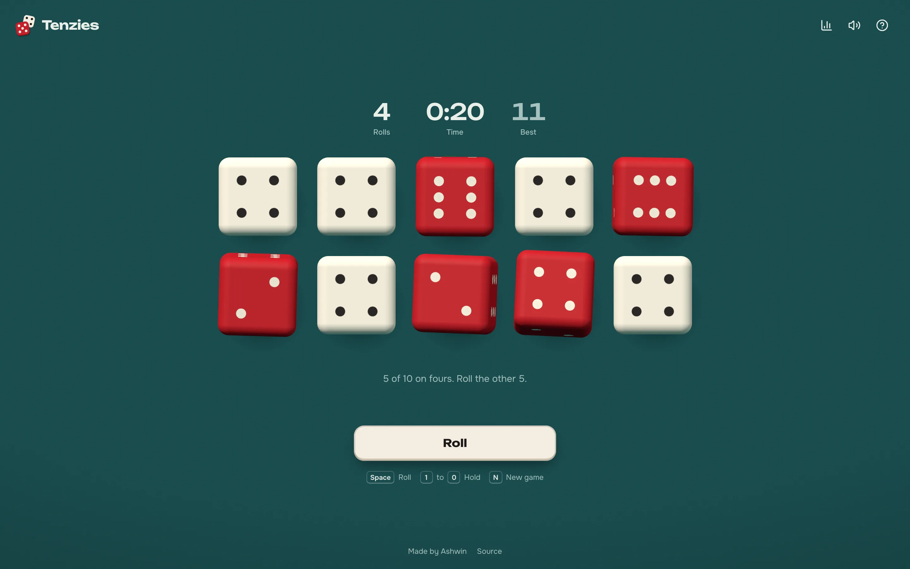
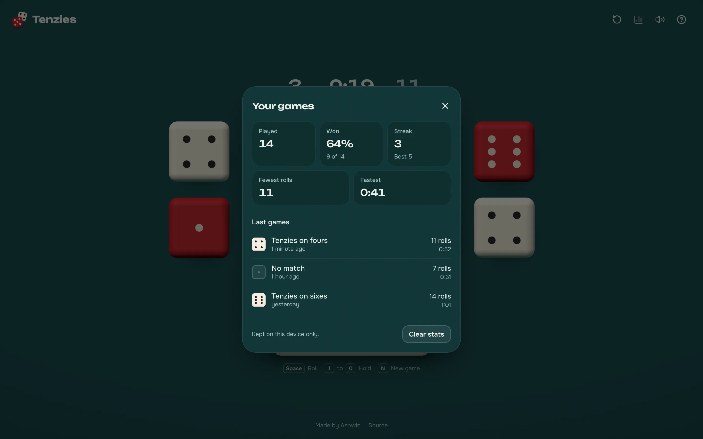
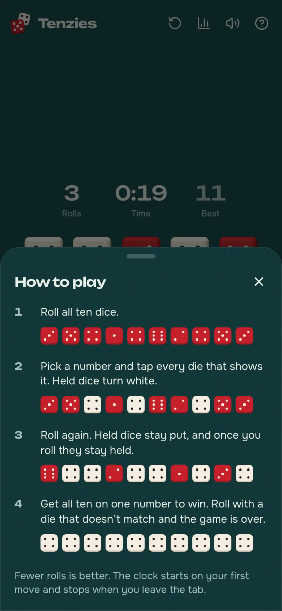
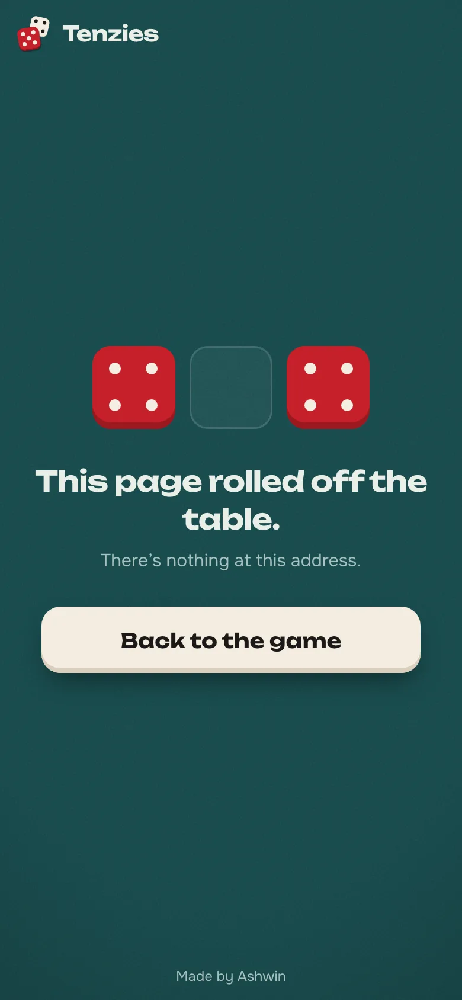

<p align="center">
  <a href="https://tenzies.ashwin.co.in">
    
  </a>
</p>

<p align="center">
  <a href="https://tenzies.ashwin.co.in"><strong>tenzies.ashwin.co.in</strong></a>
  &nbsp;·&nbsp;
  <a href="#how-it-plays">how it plays</a>
  &nbsp;·&nbsp;
  <a href="#the-design">the design</a>
  &nbsp;·&nbsp;
  <a href="#running-it">running it</a>
</p>

<br>

the source of **[tenzies.ashwin.co.in](https://tenzies.ashwin.co.in)**, a dice game. roll ten dice, hold the ones that match, and keep rolling the rest until all ten show the same number. fewer rolls is better.

this is a rebuild of my first version. the game is the same; the dice, the table, the feel and everything around them are new.

## how it plays

<p align="center">
  
  &nbsp;
  
  &nbsp;
  
</p>

- **roll, hold, repeat.** tap a die to hold it and it turns ivory. roll, and every die you didn't hold tumbles again. once you roll, held dice stay held, so pick carefully.
- **get all ten to win.** hold ten matching dice and it's tenzies. roll with a held die that doesn't match and the game is over; the odd one shakes and gets a red ring.
- **it tells you where you stand.** the line under the dice counts how many you have on which number, and warns you before you roll with dice that don't match.
- **real dice.** each die is a rounded 3d cube lit by one light, so edges and corners catch it like plastic dice do. a roll tumbles every loose die end over end, staggered, with a small bounce as it lands.
- **a clock and a best.** the clock starts on your first move and pauses when you leave the tab. your fewest rolls stays up top, and a win tells you when it's a new best, your fastest or your first.
- **your games.** played, win rate, streak, fewest rolls, fastest, and your last ten games. kept on your device only.
- **it picks up where you left off.** close the tab mid game and it's still there when you come back.
- **share a win.** the share button sends "tenzies in 14 rolls, 0:52" through your phone's share sheet, or copies it on a computer.
- **sounds.** dice clatter as they roll and click as they land, a clack when you hold, a chord when you win. made with the web audio api, quiet under the ios silent switch, and one tap to mute.
- **keys.** `space` rolls or starts again, `1` to `0` hold dice one to ten, `n` starts a new game (with undo).
- **haptics** on android phones, and a 404 where the page rolled off the table.

## the design

the page is the felt of a dice tray.

- **the felt.** a deep petrol green with a fine grain and a soft vignette, running edge to edge.
- **the dice.** casino red with ivory pips, the red from the first version. held dice turn ivory with ink pips, which is also how the first version showed a held die.
- **one light.** the dice are lit from the top left. their shadows fall to the bottom right in a dark felt tone, and the felt bounces a little teal onto their undersides, so they sit on the table rather than on top of the page.
- **type.** unbounded, wide and round like the pips, for the name, the numbers and the win line. onest for everything you read.
- **no dark mode.** the felt is already dark, so there is no toggle.
- **fits every screen.** from a 320 px phone to a 2560 px monitor, portrait or landscape, the page never scrolls. on phones the roll button sits at the bottom for your thumb; on a short landscape phone the dice line up in one row.
- **nothing jumps.** fonts are self-hosted with metric-matched fallbacks, the counters and the message line have fixed sizes, and buttons that come and go swap in place. layout shift measures 0 on load and stays at 0 while you play.
- **quiet controls.** icon buttons that aren't obvious get a small ivory tooltip on hover or keyboard focus, with the shortcut when there is one.
- **motion with a job.** the dice tumble and land, held dice fade to ivory, a win makes all ten hop in a wave, a loss shakes the odd ones out, and the page fades in once its fonts are ready so it never flashes. reduced motion turns it all off.

## the stack

| layer | choices |
| --- | --- |
| ui | [react 19](https://react.dev) and [vite 8](https://vite.dev) |
| style | [tailwind css 4](https://tailwindcss.com) |
| dice | [three.js](https://threejs.org), rounded box geometry and a small shader for the pips |
| motion | [motion](https://motion.dev) for sheets, messages and toasts |
| type | [unbounded](https://fonts.google.com/specimen/Unbounded) and [onest](https://fonts.google.com/specimen/Onest), self-hosted |
| icons | [lucide](https://lucide.dev) |
| lint and format | [biome](https://biomejs.dev) |
| hosting | [vercel](https://vercel.com/) |

## running it

```sh
git clone https://github.com/Ashwin-S-Nambiar/Tenzies.git
cd Tenzies
npm install
npm run dev
```

then open http://localhost:5173. `npm run check` runs biome, and `npm run build` writes `dist/` with a matching `404.html`.

## the shape of it

```
src/
  App.jsx             the tray, the tally, the board, the message and the buttons
  components/
    Die.jsx           one die's button, shadow and flat fallback, plus the small dice
    HowTo.jsx         the rules sheet
    Stats.jsx         your games
    Sheet.jsx         bottom sheet on phones, dialog on wider screens
    Toaster.jsx       toasts with undo
    RollingNumber.jsx the odometer for the roll count
    Mark.jsx          the two dice in the header
    NotFound.jsx      the 404
  lib/
    game.js           the rules: roll, hold, win, lose, stats
    play.js           the game store, the clock, sounds and haptics per move
    dice3d.js         the 3d dice: geometry, lighting, the tumble, holds, the win and loss
    sound.js          web audio
    tip.js            tooltips
    store.js          small stores, toasts and haptics
public/
  fonts/              unbounded and onest
```

## known rough edges

- **the dice need webgl.** without it you get flat dice that play the same but don't tumble.
- **your games stay on one device.** stats live in your browser, so clearing site data clears them.

<details>
<summary><strong>more screenshots</strong></summary>

<br>





<p align="center">
  
  &nbsp;
  
</p>

</details>

---

[tenzies.ashwin.co.in](https://tenzies.ashwin.co.in) · [ashwin.co.in](https://ashwin.co.in) · [notes](https://notes.ashwin.co.in) · [x](https://x.com/ashwinnambiar11) · [github](https://github.com/Ashwin-S-Nambiar)
